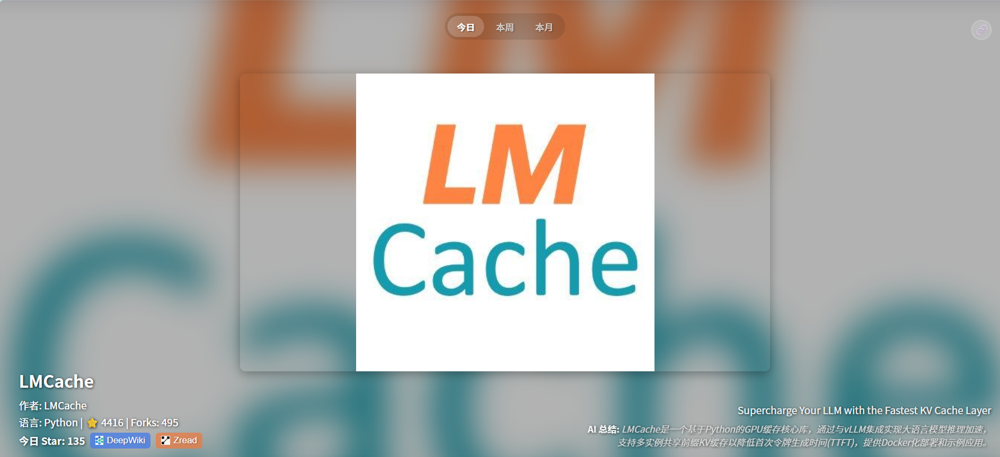

# GitTok 🚀

[](https://opensource.org/licenses/MIT)

**像刷 TikTok 一样浏览 GitHub Trending！**

GitTok 提供了一种全新的、沉浸式的方式来浏览 GitHub 上的热门项目。厌倦了传统的列表视图？试试 GitTok，享受全屏、自动播放（未来功能）的 GitHub Trending 体验！



## ✨ 特性

*   **TikTok 风格界面**: 全屏、垂直滚动浏览 GitHub Trending 项目。
*   **沉浸式体验**: 每个项目卡片都包含关键信息和作者头像背景。
*   **毛玻璃效果**: 现代化的视觉效果，突出项目信息。
*   **分享功能**: 轻松将 GitTok 项目分享给朋友或同事。
*   **Serverless API**: 使用 Vercel Serverless Functions 稳定可靠地获取 GitHub Trending 数据。
*   **AI 总结**: 利用 AI (DeepSeek) 对项目 README 进行中文总结，快速了解项目核心。

## 🛠️ 技术栈

*   **前端**: HTML, CSS, JavaScript (无框架)
*   **后端 API**: Vercel Serverless Functions (Node.js runtime)
    *   `/api/trending`: 获取 Trending 列表 (使用 `node-fetch`, `cheerio`)
    *   `/api/summarize`: 获取单个仓库的 AI 总结 (使用 `node-fetch`, `openai` SDK, DeepSeek API)
*   **AI 服务**: DeepSeek
*   **数据源**: GitHub Trending 页面, GitHub README 文件
*   **部署平台**: Vercel

## 🚀 如何运行

1.  **克隆仓库**:
    ```bash
    git clone https://github.com/LeaderOnePro/GitTok.git
    cd GitTok
    ```

2.  **安装依赖**:
    Vercel 会在部署时自动安装根 `package.json` 中的依赖。如果想在本地运行或测试 Serverless Function，可以使用 Vercel CLI:
    ```bash
    npm install -g vercel # 安装 Vercel CLI (如果尚未安装)
    npm install           # 安装项目依赖
    vercel dev            # 启动本地开发服务器 (会运行前端和 Serverless Function)
    ```
    然后访问 `http://localhost:3000` (或 Vercel CLI 指定的其他端口)。

3.  **直接打开前端 (无本地 API)**:
    如果只想查看前端界面（不调用 API），可以直接在浏览器中打开项目根目录下的 `index.html` 文件。

## 部署

本项目已配置为可以轻松部署到 [Vercel](https://vercel.com/)。

1.  确保你的代码已推送到 GitHub 仓库。
2.  在 Vercel 上导入你的 GitHub 仓库。
3.  Vercel 会自动识别项目结构（静态文件 + `api` 目录下的 Serverless Functions）并进行部署。
4.  部署完成后，你将获得一个公开的 URL。

## 📝 未来计划

*   [ ] **自动播放/滚动**: 实现更接近 TikTok 的自动滚动体验。
*   [ ] **筛选器**: 按语言、日期范围等筛选 Trending 项目。
*   [ ] **用户偏好设置**: 保存用户喜欢的语言或主题。
*   [ ] **更丰富的项目信息**: 尝试提取贡献者、更详细的活动数据等。
*   [x] **部署**: 已使用 Vercel 部署。
*   [ ] **PWA 支持**: 使其成为可安装的渐进式 Web 应用。
*   [ ] **缓存 AI 总结**: 提高性能并减少 API 调用。

## 🤝 贡献

欢迎各种形式的贡献！如果你有任何想法、建议或发现 Bug，请随时提出 Issue 或提交 Pull Request。

## 📄 许可证

本项目采用 [MIT 许可证](LICENSE)。
